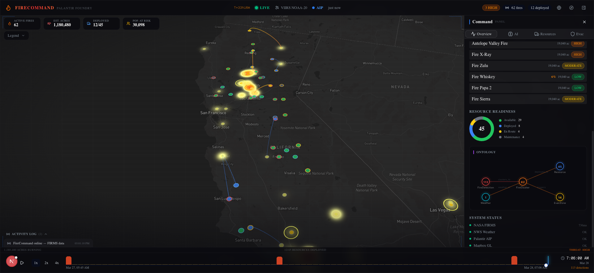
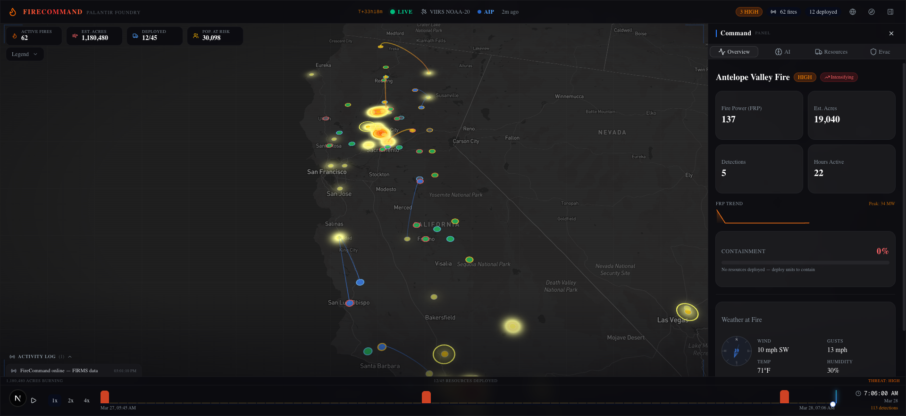
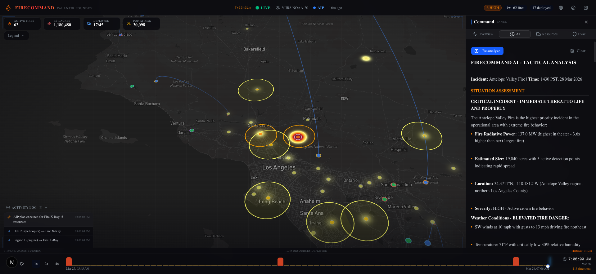
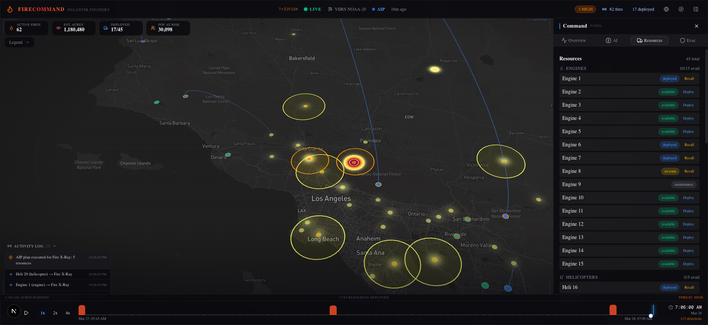
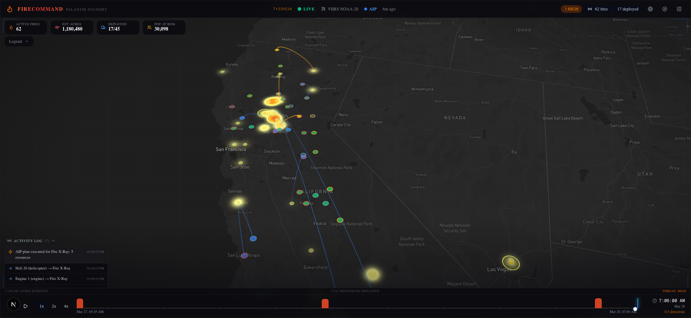

# FireCommand

**Real-time wildfire incident command platform** built for the Palantir "Build Now" hiring challenge.

FireCommand unifies live satellite fire detections, real-time weather data, AI-powered tactical analysis, and resource deployment into a single operational picture. Incident commanders get an integrated view of the fire situation with actionable intelligence.

## Screenshots

### Command Overview
Full operational picture with live satellite fire detections, heatmap visualization, fire cluster markers, and the command panel showing operational summary, fire severity list, resource readiness, and Palantir Foundry ontology graph.



### Fire Detail View
Selecting a fire cluster reveals detailed intel: fire radiative power, estimated acreage, detection count, FRP trend sparkline, containment progress, and real-time NWS weather with wind compass.



### AI Tactical Analysis
Palantir AIP Agent generates a full tactical analysis including situation assessment, priority actions, resource deployment recommendations, evacuation orders, and fire behavior predictions with confidence scoring.



### Resource Management
45 resources across 6 types (engines, helicopters, hand crews, air tankers, dozers, water tenders) with deploy/recall controls and real-time status tracking.



### Resource Deployment
Executing AI recommendations deploys resources with animated arc lines from base locations to the fire, staggered timing for cascade effect, and activity log updates.



## Features

- **Live Satellite Data** - NASA FIRMS VIIRS NOAA-20 fire detections updated every 15 minutes
- **DBSCAN Fire Clustering** - Groups nearby detections into named incident clusters with severity scoring
- **AI Tactical Analysis** - Palantir AIP Agent (or fallback) generates situation assessments, resource deployments, evacuation recommendations, and fire behavior predictions
- **Resource Management** - 45 resources across 6 types (engines, helicopters, hand crews, air tankers, dozers, water tenders) with real California base locations
- **Interactive Map** - deck.gl layers: heatmap, fire clusters, wind arrows, spread predictions, deployment arcs, containment rings, evacuation zones
- **Real Weather** - NWS weather.gov wind direction/speed/temperature/humidity for selected fires
- **Timeline Scrubbing** - Play back fire progression with sparkline activity histogram
- **Auto-Tour** - Cinematic camera flyover of high-severity fires with bearing rotation
- **ICS-209 Export** - Generate standardized incident status reports
- **Containment System** - Resource deployment contributes to containment percentage with visual arc progress

## Tech Stack

| Layer | Technology |
|-------|-----------|
| Framework | Next.js 16 (App Router), TypeScript |
| Map | react-map-gl + deck.gl (HeatmapLayer, ScatterplotLayer, ArcLayer, PolygonLayer, TextLayer) |
| State | Zustand |
| UI | shadcn/ui, Tailwind CSS 4, Lucide icons |
| AI | Palantir AIP Agent Studio / Fallback mock response |
| Data | NASA FIRMS API (CSV), NWS Weather.gov API |
| Backend | Palantir Foundry (when configured) / Standalone mode |

## Architecture

```
NASA FIRMS (satellite) --> CSV parse --> DBSCAN clustering --> Fire clusters
NWS Weather.gov ---------> Grid lookup --> Wind/temp/humidity
                                                    |
                                                    v
                                    Zustand store (app-store.ts)
                                         |         |
                                         v         v
                              deck.gl map layers  Command panel
                                         |         |
                                         v         v
                                    AI analysis --> Resource deployment
                                    (Palantir AIP)  (Containment tracking)
```

## Palantir Integration

FireCommand supports progressive enhancement:

- **Standalone** - Works fully with NASA FIRMS + Weather.gov + mock AI responses
- **Palantir AIP Agent** - When `PALANTIR_AGENT_RID` and `PALANTIR_TOKEN` are configured, AI analysis uses a real AIP Agent in Palantir Agent Studio
- **Palantir Foundry** - When OSDK is configured, data flows through the Ontology

The frontend is identical in all modes. Hooks abstract the backend.

## Getting Started

```bash
# Install dependencies
npm install

# Set environment variables
cp .env.example .env.local
# Add your NEXT_PUBLIC_MAPBOX_TOKEN, FIRMS_MAP_KEY, etc.

# Run development server
npm run dev
```

Required environment variables:
- `NEXT_PUBLIC_MAPBOX_TOKEN` - Mapbox access token
- `FIRMS_MAP_KEY` - NASA FIRMS API key

Optional (Palantir integration):
- `PALANTIR_FOUNDRY_URL` - Foundry instance URL
- `PALANTIR_TOKEN` - Foundry auth token
- `PALANTIR_AGENT_RID` - AIP Agent RID

## Keyboard Shortcuts

| Key | Action |
|-----|--------|
| `Space` | Play / Pause timeline |
| `T` | Auto-tour high-severity fires |
| `P` | Toggle command panel |
| `Esc` | Stop tour / deselect / close |
| `1` / `2` / `4` | Playback speed |
| `Shift+1-4` | Switch panel tab |
| `Left` / `Right` | Step timeline |
| `?` | Help overlay |

## License

MIT
